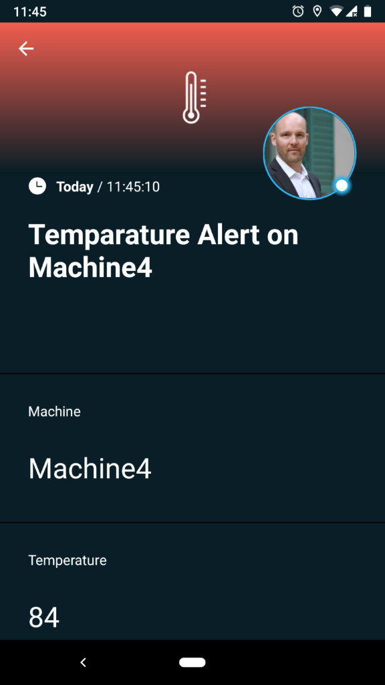
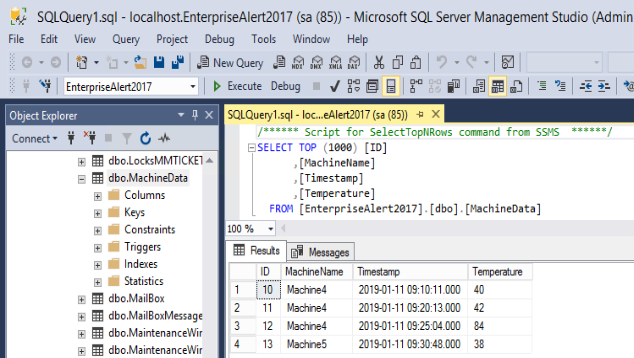

# Integrate SIGNL4 with SQL Server
Integrate SIGNL4 with a database for mobile alerting via app, push, text, voice with tracking and escalation.

## Why SIGNL4
In industry and production scenarios a lot of machine data is available. This can be the temperature of certain machines, timespans of certain processes, pressure, power consumption, vibration, etc. The data is (or can be made) available in database tables and sometimes it is already being displayed on dashboards on computer screens. Of course in daily operations it is hard to look at each relevant dashboard all the time. Therefore, it makes sense to send relevant information about critical situations to the responsible users in real time no matter where they are. That is where SIGNL4 comes in.
Integrating SIGNL4 with any database can enhance your daily operations with an extension to your mobile team in the field or on the shop floor.

## How it Works
All it takes to check relevant information and to send alerts using SIGNL4 is a little script with a suitable SQL query that checks the database in regular intervals.

## Integration Capabilities
- Service engineers alerted via mobile push, text and voice
- Staff can acknowledge and take ownership for critical events that occur
- Alerts are escalated in case of no response
- Communicate within an alert to address a particular problem
- Alert on critical device states
- Two-way integration to interact or set the device state

## Scenarios
- Industrial IoT
- Industry 4.0
- Integration with legacy systems
- IoT Service Alerting
- IoT Device Management
- IT Operations
- Manufacturing, Utility, Oil and Gas, Agriculture, etc.

## Integrating SIGNL4 with SQL Server

Gathering information from a database and sending team alerts in case of critical incidents is achieved with a simple script. In our case we use a JavaScript or PowerShell script that connect to the database, executes an SQL Select statement and sends an alert via SIGNL4 if necessary.

SIGNL4 is a mobile alert notification app for powerful alerting, alert management and for mobile assignment of work items. Get the app at https://www.signl4.com.

Microsoft SQL Server is a widely used database. Of course any other database will work in a similar way.

### Prerequisites

A SIGNL4 (https://www.signl4.com) account
A Microsoft SQL Server database

### Integration Steps

To make your life easier we provide a fully working sample on GitHub at https://github.com/signl4/signl4-integration-sql-server. This includes the JavaScript and PowerShell scripts as well as the SQL statements for creating the database table and inserting some sample data.

#### Create the Database Table

In SQL Server you can create a database table as follows.

#### Create the JavaScript or PowerShell Script

Now you can create script in JavaScript or PowerShell (or whatever language you prefer) to do the following

1. Connect to the database.

2. Execute an SQL Select query to retrieve relevant records
In our case we just check for temperatures higher than 80 degrees within the last ten minutes.

SELECT [MachineName], MAX(Temperature) FROM [dbo].[MachineData] WHERE Timestamp > DATEADD(MINUTE, -10, SYSDATETIME()) AND Temperature > 80 GROUP BY [MachineName];

You can adapt the query to fit your needs. You can also to some more sophisticated operations here like the average, maximum, number of occurrences or process data from multiple tables as well.

3. Send the Alert using SIGNL4
If the above SQL query retrieved some records it means we have a situation worth communicating. In our script we use the SIGNL4 webhook to send the data to SIGNL4.

#### Run the Script in regular Intervals

Of course, we would like to check the database in regular intervals. In Windows the easiest way to do so is to use the Windows Task Scheduler. Here you can create a new task, let it run every ten minutes and let it execute the respective script.

#### Test It

Now you can test your script manually first. Add some sample date into the database table that should trigger an alert. If all runs find you will receive the alert in your SIGNL4 app.
